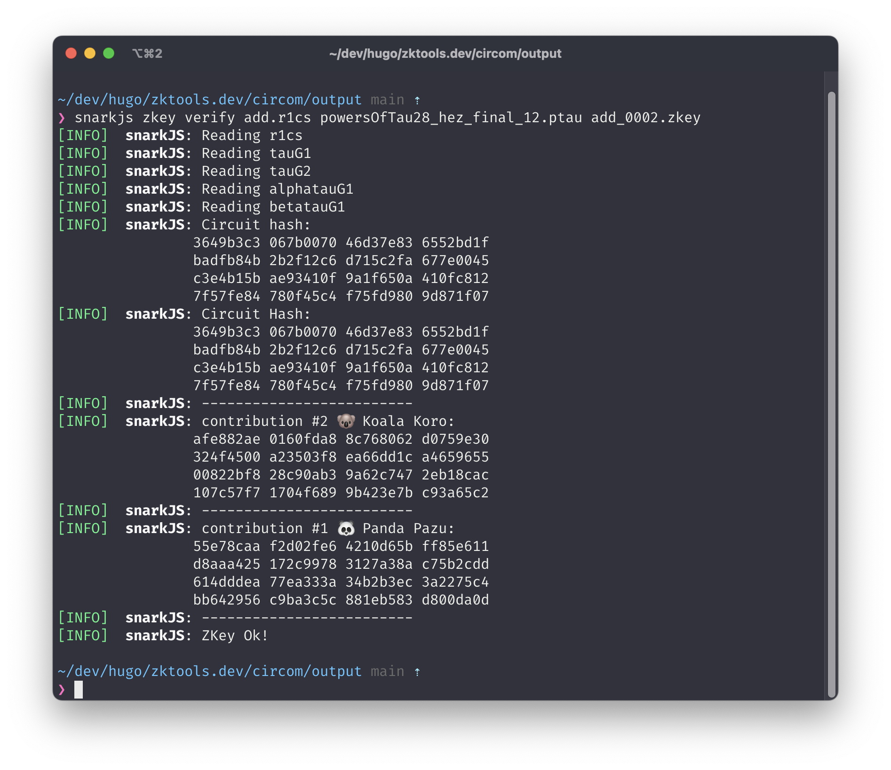

# [🤫🔍 ZKtools.dev](https://zktools.dev/)

An online ZK debugging tool built during [ETHBerlin24](https://ethberlin.org/) 🔍.



## How to run

```bash
npm run dev
```

## Infra

Deployed on Vercel.

## Built with

- [snarkjs](https://github.com/iden3/snarkjs)
- [Next.js](https://nextjs.org/)
- [tailwindcss](https://tailwindcss.com/)
- [preline](https://preline.co/index.html)
- [Monaco Editor](https://microsoft.github.io/monaco-editor/)

## Other

Inspired by:

- [evm.codes](https://www.evm.codes/)

⚠️ Warning:

- The `zkey` file provided in this repo are used for demonstration purposes only and should not be used in production.

## Resources

- <https://www.rareskills.io/post/rank-1-constraint-system>
- <https://docs.circom.io/getting-started/proving-circuits/>
